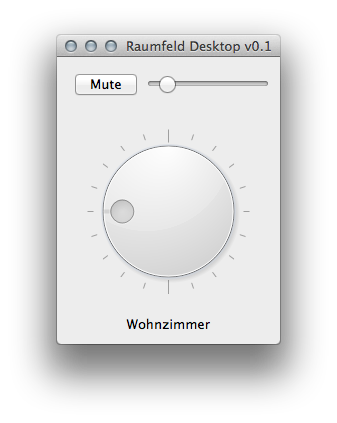

Raumfeld-Desktop
================
Python Desktop Controller for Teufel Raumfeld

This program aims to bring basic Raumfeld controls (next / previous, start / pause, volume) to the desktop.
As the software is written in Python it will run on Windows, Linux and Mac OS X. Compatible with Python2 and Python3.

If you are only interested in automatic device discovery and communication have a look at `raumfeld.py`.

Please use the issue tracker for bugs and feature requests.

Installation
------------
You can use the prepackaged binaries for Windows and Mac OS X:

- Windows x64
- Windows x86
- Mac OS X

To install the requirements (PySide and pysimplesoap):

    pip install -r requirements.txt

Example usage of the module `raumfeld.py`
-----------------------------------------

    import raumfeld

    # discovery returns a list of RaumfeldDevices
    devices = raumfeld.discover(timeout=1, retries=1)
    if len(devices) > 0:
        speaker = devices[0]
        # muting
        speaker.mute()
        # get the current volume
        print(speaker.volume)
        # set the volume
        speaker.volume = 50
    else:
        print('No devices found.')
